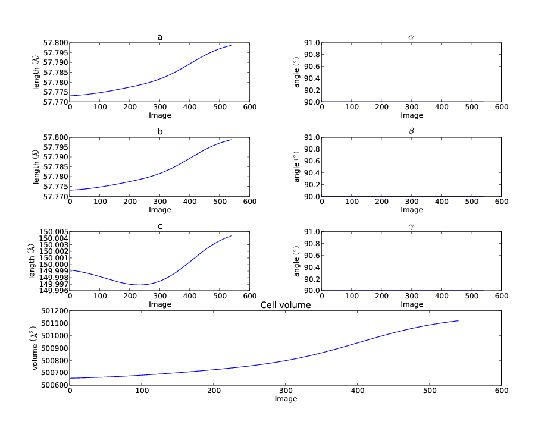

Advanced Tutorial
=================

Introduction
------------

DIALS processing may be performed by either running the individual tools (spot
finding, indexing, refinement, integration, exporting to MTZ) or you can run the
whole lot through :doc:`dials.process </programs/dials_process>`, which just
chains them together (and incidentally does all of the processing in P1.)

dials.process
-------------

In the simplest case, :doc:`dials.process </programs/dials_process>`
``/here/are/all/images*.cbf`` will do sensible processing, with a static model
of the experiment and sample, and will output a reflection file integrated.mtz
containing the intensity measurements assuming everything works correctly.
Some sensible options to use are:

 - :samp:`scan_varying=true` - allow the crystal orientation and unit cell
   constants to vary during the scan
 - :samp:`mp.nproc=1` - only use one processor (necessary currently for data in
   NeXus files)
 - :samp:`intensity.algorithm=sum` - use summation integtration, other
   algorithms are being added
 - :samp:`block_size=N` - for some N, split the data set into N degree blocks
   for integration, so as not to overload the computer
 - :samp:`-i` - pass the images to process through the standard input e.g. from
   :samp:`find . -name *.cbf` to avoid issues with limited command-line lengths

Running the Individual Steps: Macromolecule
-------------------------------------------

The following example uses a Thaumatin dataset collected using beamline I04
at Diamond Light Source which is available for download from |thaumatin|.

.. |thaumatin| image:: https://zenodo.org/badge/doi/10.5281/zenodo.10271.png
               :target: http://dx.doi.org/10.5281/zenodo.10271

A complete example script can be found
:download:`here<../user-tutorial/tutorial.sh>`, which can be run as follows::

  ./tutorial.sh /path/to/data

Import
^^^^^^

The first stage of step-by-step DIALS processing is to import the data - all
that happens here is that the image headers are read, and a file describing
their contents (:samp:`datablock.json`) is written. It's worth noting that if
this file is changed subsequent processing (even with :samp:`dials.process`) can
use this.

::

  dials.import data/th_8_2_0*cbf

The output just describes what the software understands of the images it was
passed, in this case one sweep of data containing 540 images.

::

  The following parameters have been modified:

  input {
    datablock = <image files>
  }

  --------------------------------------------------------------------------------
  DataBlock 0
    format: <class 'dxtbx.format.FormatCBFMiniPilatusDLS6MSN100.FormatCBFMiniPilatusDLS6MSN100'>
    num images: 540
    num sweeps: 1
    num stills: 0
  --------------------------------------------------------------------------------
  Writing datablocks to datablock.json

Find Spots
^^^^^^^^^^

The first "real" task in any DIALS processing will be the spot finding.
Here we request multiple processors to speed up the spot-finding (nproc=4).

::

  dials.find_spots datablock.json nproc=4

This will just report the number of spots found.

::

  The following parameters have been modified:

  spotfinder {
    mp {
      nproc = 4
    }
  }
  input {
    datablock = datablock.json
  }

  Configuring spot finder from input parameters
  --------------------------------------------------------------------------------
  Finding strong spots in imageset 0
  --------------------------------------------------------------------------------

  Finding spots in image 0 to 540...
  Extracting strong pixels from images (may take a while)
  Extracted strong pixels from images
  Merging 4 pixel lists
  Merged 4 pixel lists with 922120 pixels
  Extracting spots
  Extracted 219125 spots
  Calculating 219125 spot centroids
  Calculated 219125 spot centroids
  Calculating 219125 spot intensities
  Calculated 219125 spot intensities
  Filtering 219125 spots by number of pixels
  Filtered 116321 spots by number of pixels
  Filtering 116321 spots by peak-centroid distance
  Filtered 116082 spots by peak-centroid distance

  --------------------------------------------------------------------------------
  Saving 116082 reflections to strong.pickle
  Saved 116082 reflections to strong.pickle
  Time Taken: 28.706979

The default parameters for :doc:`dials.find_spots </programs/dials_find_spots>`
usually do a good job
for Pilatus images, such as these. However they may not be optimal for data from
other detector types, such as CCDs or image plates. Issues with incorrectly
set gain or sigma thresholds might lead to far too many spots being extracted
(for example). If you are having issues with spot finding, it is worth
inspecting the images with :program:`dials.image_viewer`::

  dials.image_viewer datablock.json

Viewing the various images from 'image' to 'threshold' gives an idea of how the
various parameters affect the spot finding algorithm. The final image,
'threshold' is the one on which spots are found, so ensuring this produces peaks
at real diffraction spot positions will give the best chance of success.

Having found strong spots it is worth checking the image viewer again::

  dials.image_viewer datablock.json strong.pickle

The :program:`dials.image_viewer` tool is not as fast as tools such as ADXV,
however it does integrate well with DIALS data files. Information about
the beam centre, spot centroids, reflection shoeboxes and other data stored in
the pickle files created by DIALS programs can be overlayed on the diffraction
images. You may need to adjust the colour scheme and brightness to get the best
out of it. A brightness of 20 with the 'invert' colour scheme works well with
this data. Move forward a few images to find a spot whose complete rocking curve
is recorded. The highest valued pixel in that three dimensional spot is marked
with a pink dot. The spot centre of mass is a red cross. This is usually close to
the peak pixel, but slightly offset as the centroid algorithm allows to calculate
the spot centre at a better precision than the pixel size and image angular 'width'.
The strong pixels marked as being part of the peak are highlighted with a green
dot. The reflection shoebox shown here is the smallest three dimensional box that
can contain the continuous peak region, that is, there is no background border
region displayed here.

Indexing
^^^^^^^^

The next step will be indexing of the strong spots, by default using a 3D FFT
algorithm, although the 1D FFT algorithm can be selected using the parameter
:samp:`indexing.method=fft1d`.

::

  dials.index datablock.json strong.pickle

If known, the space group and unit cell can be
provided at this stage using the :samp:`space_group` and :samp:`unit_cell`
parameters, otherwise indexing and refinement will be carried out in the
primitive lattice using space group P1.

::

  The following parameters have been modified:

  input {
    datablock = datablock.json
    reflections = strong.pickle
  }

  Found max_cell: 229.7 Angstrom
  Setting d_min: 4.48575618871
  FFT gridding: (256,256,256)
  Number of centroids used: 8627
  model 1 (7863 reflections):
  Crystal:
      Unit cell: (58.179, 58.461, 149.622, 90.337, 90.317, 90.560)
      Space group: P 1
      U matrix:  {{-0.2595,  0.3410,  0.9035},
                  { 0.3839,  0.8949, -0.2275},
                  {-0.8862,  0.2878, -0.3632}}
      B matrix:  {{ 0.0172,  0.0000,  0.0000},
                  { 0.0002,  0.0171,  0.0000},
                  { 0.0001,  0.0001,  0.0067}}
      A = UB:    {{-0.0043,  0.0059,  0.0060},
                  { 0.0067,  0.0153, -0.0015},
                  {-0.0152,  0.0049, -0.0024}}

  757 unindexed reflections

  ################################################################################
  Starting refinement (macro-cycle 1)
  ################################################################################

  Summary statistics for observations matched to predictions:
  -----------------------------------------------------------------------
  |                   | Min     | Q1       | Med      | Q3     | Max    |
  -----------------------------------------------------------------------
  | Xc - Xo (mm)      | -0.7665 | -0.4922  | -0.05848 | 0.1489 | 0.4568 |
  | Yc - Yo (mm)      | -0.8621 | -0.4161  | 0.04831  | 0.2403 | 0.5781 |
  | Phic - Phio (deg) | -0.442  | -0.01297 | 0.1146   | 0.2693 | 0.9865 |
  | X weights         | 113.8   | 134.7    | 135      | 135.1  | 135.2  |
  | Y weights         | 119.2   | 134.9    | 135.1    | 135.2  | 135.2  |
  | Phi weights       | 162.5   | 177.1    | 177.5    | 177.7  | 177.8  |
  -----------------------------------------------------------------------

  Refinement steps:
  ------------------------------------------------
  | Step | Nref | RMSD_X   | RMSD_Y   | RMSD_Phi |
  |      |      | (mm)     | (mm)     | (deg)    |
  ------------------------------------------------
  | 0    | 4049 | 0.38369  | 0.37431  | 0.23548  |
  | 1    | 4049 | 0.12009  | 0.11387  | 0.18697  |
  | 2    | 4049 | 0.088057 | 0.081596 | 0.14271  |
  | 3    | 4049 | 0.048008 | 0.048841 | 0.076388 |
  | 4    | 4049 | 0.026475 | 0.035665 | 0.02821  |
  ------------------------------------------------
  RMSD target achieved

  RMSDs by experiment:
  ---------------------------------------------
  | Exp | Nref | RMSD_X  | RMSD_Y  | RMSD_Z   |
  |     |      | (px)    | (px)    | (images) |
  ---------------------------------------------
  | 0   | 4049 | 0.15392 | 0.20735 | 0.18806  |
  ---------------------------------------------
  Increasing resolution to 3.5 Angstrom
  model 1 (18444 reflections):
  Crystal:
      Unit cell: (57.728, 57.789, 149.916, 90.036, 90.022, 90.045)
      Space group: P 1
      U matrix:  {{-0.2595,  0.3443,  0.9023},
                  { 0.3901,  0.8920, -0.2281},
                  {-0.8834,  0.2928, -0.3658}}
      B matrix:  {{ 0.0173,  0.0000,  0.0000},
                  { 0.0000,  0.0173,  0.0000},
                  { 0.0000,  0.0000,  0.0067}}
      A = UB:    {{-0.0045,  0.0060,  0.0060},
                  { 0.0068,  0.0154, -0.0015},
                  {-0.0153,  0.0051, -0.0024}}

  86 unindexed reflections

  ################################################################################
  Starting refinement (macro-cycle 2)
  ################################################################################

  Summary statistics for observations matched to predictions:
  --------------------------------------------------------------------------
  |                   | Min     | Q1        | Med       | Q3      | Max    |
  --------------------------------------------------------------------------
  | Xc - Xo (mm)      | -0.2878 | -0.04705  | -0.006913 | 0.01925 | 0.2118 |
  | Yc - Yo (mm)      | -0.7567 | -0.04353  | -0.01401  | 0.01291 | 0.267  |
  | Phic - Phio (deg) | -1.018  | -0.005569 | 0.008174  | 0.02477 | 0.9063 |
  | X weights         | 110.6   | 134.7     | 135       | 135.1   | 135.2  |
  | Y weights         | 114     | 134.8     | 135.1     | 135.2   | 135.2  |
  | Phi weights       | 160.2   | 177.2     | 177.5     | 177.7   | 177.8  |
  --------------------------------------------------------------------------

  Refinement steps:
  ------------------------------------------------
  | Step | Nref | RMSD_X   | RMSD_Y   | RMSD_Phi |
  |      |      | (mm)     | (mm)     | (deg)    |
  ------------------------------------------------
  | 0    | 4049 | 0.053588 | 0.049049 | 0.0335   |
  ------------------------------------------------
  RMSD target achieved

  RMSDs by experiment:
  ---------------------------------------------
  | Exp | Nref | RMSD_X  | RMSD_Y  | RMSD_Z   |
  |     |      | (px)    | (px)    | (images) |
  ---------------------------------------------
  | 0   | 4049 | 0.31156 | 0.28517 | 0.22334  |
  ---------------------------------------------
  Increasing resolution to 2.5 Angstrom
  model 1 (47501 reflections):
  Crystal:
      Unit cell: (57.728, 57.789, 149.916, 90.036, 90.022, 90.045)
      Space group: P 1
      U matrix:  {{-0.2595,  0.3443,  0.9023},
                  { 0.3901,  0.8920, -0.2281},
                  {-0.8834,  0.2928, -0.3658}}
      B matrix:  {{ 0.0173,  0.0000,  0.0000},
                  { 0.0000,  0.0173,  0.0000},
                  { 0.0000,  0.0000,  0.0067}}
      A = UB:    {{-0.0045,  0.0060,  0.0060},
                  { 0.0068,  0.0154, -0.0015},
                  {-0.0153,  0.0051, -0.0024}}

  137 unindexed reflections

  ################################################################################
  Starting refinement (macro-cycle 3)
  ################################################################################

  Summary statistics for observations matched to predictions:
  ----------------------------------------------------------------------------
  |                   | Min     | Q1        | Med       | Q3        | Max    |
  ----------------------------------------------------------------------------
  | Xc - Xo (mm)      | -0.3519 | -0.0555   | -0.001571 | 0.0559    | 0.3489 |
  | Yc - Yo (mm)      | -0.7567 | -0.08436  | -0.03925  | -0.001229 | 0.267  |
  | Phic - Phio (deg) | -1.018  | -0.006324 | 0.009059  | 0.02707   | 0.9063 |
  | X weights         | 101.4   | 134.1     | 134.8     | 135.1     | 135.2  |
  | Y weights         | 103.4   | 134       | 134.8     | 135.1     | 135.2  |
  | Phi weights       | 157.8   | 176.8     | 177.4     | 177.7     | 177.8  |
  ----------------------------------------------------------------------------

  Refinement steps:
  ------------------------------------------------
  | Step | Nref | RMSD_X   | RMSD_Y   | RMSD_Phi |
  |      |      | (mm)     | (mm)     | (deg)    |
  ------------------------------------------------
  | 0    | 4049 | 0.076108 | 0.080995 | 0.031115 |
  | 1    | 4049 | 0.065334 | 0.062245 | 0.033363 |
  | 2    | 4049 | 0.064364 | 0.060599 | 0.031324 |
  | 3    | 4049 | 0.062474 | 0.057821 | 0.027249 |
  | 4    | 4049 | 0.058481 | 0.052493 | 0.022337 |
  | 5    | 4049 | 0.051417 | 0.043149 | 0.019344 |
  ------------------------------------------------
  RMSD target achieved

  RMSDs by experiment:
  ---------------------------------------------
  | Exp | Nref | RMSD_X  | RMSD_Y  | RMSD_Z   |
  |     |      | (px)    | (px)    | (images) |
  ---------------------------------------------
  | 0   | 4049 | 0.29894 | 0.25087 | 0.12896  |
  ---------------------------------------------
  Increasing resolution to 1.5 Angstrom
  model 1 (113986 reflections):
  Crystal:
      Unit cell: (57.782, 57.797, 150.013, 90.028, 90.012, 90.001)
      Space group: P 1
      U matrix:  {{-0.2594,  0.3449,  0.9021},
                  { 0.3909,  0.8916, -0.2285},
                  {-0.8831,  0.2933, -0.3661}}
      B matrix:  {{ 0.0173,  0.0000,  0.0000},
                  { 0.0000,  0.0173,  0.0000},
                  { 0.0000,  0.0000,  0.0067}}
      A = UB:    {{-0.0045,  0.0060,  0.0060},
                  { 0.0068,  0.0154, -0.0015},
                  {-0.0153,  0.0051, -0.0024}}

  328 unindexed reflections

  ################################################################################
  Starting refinement (macro-cycle 4)
  ################################################################################

  Summary statistics for observations matched to predictions:
  ------------------------------------------------------------------------
  |                   | Min     | Q1       | Med      | Q3      | Max    |
  ------------------------------------------------------------------------
  | Xc - Xo (mm)      | -0.4481 | -0.04225 | 0.002675 | 0.05481 | 0.5976 |
  | Yc - Yo (mm)      | -1.203  | -0.08534 | -0.02826 | 0.01359 | 1.462  |
  | Phic - Phio (deg) | -1.446  | -0.01371 | 0.001714 | 0.01714 | 0.9092 |
  | X weights         | 81.12   | 131.3    | 133.8    | 134.9   | 135.2  |
  | Y weights         | 87.23   | 130      | 133.3    | 134.7   | 135.2  |
  | Phi weights       | 145.2   | 176.2    | 177.4    | 177.8   | 177.8  |
  ------------------------------------------------------------------------

  Refinement steps:
  ------------------------------------------------
  | Step | Nref | RMSD_X   | RMSD_Y   | RMSD_Phi |
  |      |      | (mm)     | (mm)     | (deg)    |
  ------------------------------------------------
  | 0    | 4049 | 0.080234 | 0.097167 | 0.028632 |
  | 1    | 4049 | 0.077529 | 0.084989 | 0.028778 |
  | 2    | 4049 | 0.076159 | 0.083021 | 0.028573 |
  | 3    | 4049 | 0.072759 | 0.078706 | 0.02818  |
  | 4    | 4049 | 0.065409 | 0.069857 | 0.027744 |
  | 5    | 4049 | 0.055575 | 0.057951 | 0.027327 |
  | 6    | 4049 | 0.050327 | 0.05123  | 0.027053 |
  ------------------------------------------------
  RMSD target achieved

  RMSDs by experiment:
  --------------------------------------------
  | Exp | Nref | RMSD_X | RMSD_Y  | RMSD_Z   |
  |     |      | (px)   | (px)    | (images) |
  --------------------------------------------
  | 0   | 4049 | 0.2926 | 0.29785 | 0.18035  |
  --------------------------------------------
  Increasing resolution to 0.5 Angstrom
  model 1 (114691 reflections):
  Crystal:
      Unit cell: (57.786, 57.800, 150.027, 90.018, 90.003, 89.996)
      Space group: P 1
      U matrix:  {{-0.2592,  0.3453,  0.9020},
                  { 0.3910,  0.8915, -0.2289},
                  {-0.8831,  0.2934, -0.3660}}
      B matrix:  {{ 0.0173,  0.0000,  0.0000},
                  {-0.0000,  0.0173,  0.0000},
                  { 0.0000,  0.0000,  0.0067}}
      A = UB:    {{-0.0045,  0.0060,  0.0060},
                  { 0.0068,  0.0154, -0.0015},
                  {-0.0153,  0.0051, -0.0024}}

  341 unindexed reflections

  ################################################################################
  Starting refinement (macro-cycle 5)
  ################################################################################

  Summary statistics for observations matched to predictions:
  -------------------------------------------------------------------------
  |                   | Min     | Q1       | Med       | Q3      | Max    |
  -------------------------------------------------------------------------
  | Xc - Xo (mm)      | -0.5604 | -0.03285 | -0.003436 | 0.03071 | 0.6503 |
  | Yc - Yo (mm)      | -1.412  | -0.02725 | 0.001642  | 0.02774 | 1.255  |
  | Phic - Phio (deg) | -1.408  | -0.01358 | 0.0004774 | 0.01514 | 0.9071 |
  | X weights         | 81.12   | 131.2    | 133.8     | 134.9   | 135.2  |
  | Y weights         | 87.23   | 130      | 133.3     | 134.7   | 135.2  |
  | Phi weights       | 145.2   | 176.2    | 177.5     | 177.8   | 177.8  |
  -------------------------------------------------------------------------

  Refinement steps:
  -----------------------------------------------
  | Step | Nref | RMSD_X  | RMSD_Y   | RMSD_Phi |
  |      |      | (mm)    | (mm)     | (deg)    |
  -----------------------------------------------
  | 0    | 4049 | 0.05131 | 0.046971 | 0.028166 |
  -----------------------------------------------
  RMSD target achieved

  RMSDs by experiment:
  ---------------------------------------------
  | Exp | Nref | RMSD_X  | RMSD_Y  | RMSD_Z   |
  |     |      | (px)    | (px)    | (images) |
  ---------------------------------------------
  | 0   | 4049 | 0.29831 | 0.27309 | 0.18777  |
  ---------------------------------------------
  Final refined crystal models:
  model 1 (114691 reflections):
  Crystal:
      Unit cell: (57.786, 57.800, 150.027, 90.018, 90.003, 89.996)
      Space group: P 1
      U matrix:  {{-0.2592,  0.3453,  0.9020},
                  { 0.3910,  0.8915, -0.2289},
                  {-0.8831,  0.2934, -0.3660}}
      B matrix:  {{ 0.0173,  0.0000,  0.0000},
                  {-0.0000,  0.0173,  0.0000},
                  { 0.0000,  0.0000,  0.0067}}
      A = UB:    {{-0.0045,  0.0060,  0.0060},
                  { 0.0068,  0.0154, -0.0015},
                  {-0.0153,  0.0051, -0.0024}}

It is worth looking through this output to understand what the indexing program
has done. Note that this output (minus the preamble about modified parameters)
is automatically captured in the file :file:`dials.index.log`. There is also
a great deal more information written into :file:`dials.index.debug.log`, but
this is probably only helpful if something has gone wrong and you are trying
to track down why.

Inspecting the log shows that the indexing step is done at fairly low
resolution ``Setting d_min: 4.48575618871``. What follows are five macrocycles
of refinement at increasing resolution to bootstrap the indexing solution to as
many of the strong reflections as possible. In each case you can see that only
4049 reflections are used in the refinement job. The diffraction geometry is
here described by only 16 parameters (6 for the detector, 1 beam angle, 3
crystal 'misset' angles and 6 triclinic cell parameters). The problem is thus
hugely overdetermined. In order to save time, refinement uses a subset of the
input reflections, by default using 50 reflections for every degree of the scan.

Inspecting the log closely, we see that the first macrocyle of refinement makes
a big improvement, reducing the positional RMSDs from 0.38 to 0.03 mm in X and
0.37 to 0.04 mm in Y. The second macrocycle doesn't actually change the model
at all. After extending to 3.5 Angstroms the current model still predicts
all reflections with RMSDs within one third of the pixel size and one third of
the angular width. Refinement terminates immediately, as by default this is
considered a good enough model to proceed. This is fairly unusual, and is an
indication of the very high quality of this particular dataset. After extending
to 2.5 Angstroms the current model ceases to be good enough to predict the
high resolution reflections. Refinement optimises the model until again the
predictions are within the RMSD target. The same occurs after extending to
1.5 Angstroms. In the final macrocyle, the resolution limit is extended to 0.5
Angstroms, well beyond the highest resolution recorded 'strong' spot, which is
1.17 Angstroms. Refinement has
nothing to do because the current model still predicts with low enough RMSDs
right out to the maximum resolution of the dataset.

Despite the high quality of this data, we notice from the summary statistics
tables that there there are some outliers appearing as resolution increases,
especially in the last two macrocycles. In the final macrocyle we see the
distribution of positional residuals in the Y direction is tight around the
median, except for extreme values both positive and negative of more than 1 mm.
The angular residuals show a similar pattern with half the data having residuals
of less than about 0.14 degrees from the predicted positions, but the extreme
is as much as 1.4 degrees from the predicted diffraction angle. We are happy
with the indexing solution though and will deal with these outliers in the
separate refinement step to come later.

If you want to specify the Bravais lattice for processing (i.e. include the
lattice constraints in the refinement) then you need to either specify this
lattice at this stage as

::

  space_group=P4

as a command-line option to :doc:`dials.index </programs/dials_index>`
or you can use
:doc:`dials.refine_bravais_settings </programs/dials_refine_bravais_settings>`,
which will take the results of the P1 autoindexing and run refinement with all
of the possible Bravais settings applied - after which you may select the
preferred solution.

::

  dials.refine_bravais_settings experiments.json indexed.pickle

gives a table containing the metric fit, rmsds (in mm) and unit cell for
each Bravais setting...

::

  The following parameters have been modified:

  input {
    experiments = experiments.json
    reflections = indexed.pickle
  }

  -------------------------------------------------------------------------------------------------------------
  Solution Metric fit  rmsd #spots  crystal_system                                 unit_cell  volume      cb_op
  -------------------------------------------------------------------------------------------------------------
         9  0.0197 dg 0.069   4049   tetragonal tP  57.79  57.79 150.01  90.00  90.00  90.00  500936      a,b,c
         8  0.0197 dg 0.069   4049 orthorhombic oC  81.72  81.73 150.01  90.00  90.00  90.00 1001961  a-b,a+b,c
         7  0.0167 dg 0.069   4049 orthorhombic oP  57.78  57.79 150.01  90.00  90.00  90.00  500920      a,b,c
         6  0.0197 dg 0.068   4049   monoclinic mC  81.72  81.73 150.01  90.00  89.99  90.00 1001915  a-b,a+b,c
         5  0.0184 dg 0.069   4049   monoclinic mC  81.73  81.72 150.01  90.00  90.01  90.00 1001960 a+b,-a+b,c
         4  0.0167 dg 0.069   4049   monoclinic mP  57.78  57.79 150.01  90.00  90.00  90.00  500920      a,b,c
         3  0.0160 dg 0.069   4049   monoclinic mP  57.78 150.01  57.80  90.00  89.99  90.00  500960   -a,-c,-b
         2  0.0051 dg 0.067   4049   monoclinic mP  57.79  57.78 150.01  90.00  90.01  90.00  500911   -b,-a,-c
         1  0.0000 dg 0.067   4049    triclinic aP  57.78  57.79 150.01  90.01  90.00  90.00  500930      a,b,c
  -------------------------------------------------------------------------------------------------------------
  usr+sys time: 0.84 seconds
  wall clock time: 3.92 seconds

In this example we would continue processing (i.e. proceed to the refinement
step, perhaps) with :samp:`bravais_setting_9.json`. Sometimes it may be
necessary to reindex the :samp:`indexed.pickle` file output by dials.index.
However, in this case as the change of basis operator to the chosen setting
is the identity operator (:samp:`a,b,c`) this step is not needed::

  dials.reindex indexed.pickle change_of_basis_op=a,b,c

This outputs the file :samp:`reindexed_reflections.pickle` which should be
used as input to downstream programs in place of :samp:`indexed.pickle`.

Refinement
^^^^^^^^^^

Although the model is already refined in indexing we can also add a refinement
step using :doc:`dials.refine </programs/dials_refine>` in here. This
dataset is of exceptional quality and we wish to squeeze the best possible
results from it. During indexing we saw the presence of outliers that we would
like to exclude from refinement, and we also used a subset of reflections. Now
we will repeat using all indexed reflections in the dataset and with outlier
rejection switched on. To force refinement to continue until the RMSDs converge
we also have to use the expert parameter ``bin_size_fraction`` to set the
RMSD target to zero in each dimension.

As an aside, to show all the options up to and including ``expert_level = 1``
use this command::

  dials.refine -c -e 1

Now, our refinement job is specified as::

  dials.refine bravais_setting_9.json reindexed_reflections.pickle \
  do_outlier_rejection=true use_all_reflections=true bin_size_fraction=0.0

The main product of this is the file ``refined_experiments.json``

::

  The following parameters have been modified:

  refinement {
    target {
      bin_size_fraction = 0.0
    }
    reflections {
      use_all_reflections = true
      do_outlier_rejection = true
    }
  }
  input {
    experiments = bravais_setting_9.json
    reflections = reindexed_reflections.pickle
  }

  Configuring refiner

  Summary statistics for observations matched to predictions:
  --------------------------------------------------------------------------
  |                   | Min     | Q1        | Med       | Q3      | Max    |
  --------------------------------------------------------------------------
  | Xc - Xo (mm)      | -0.5507 | -0.03321  | -0.002888 | 0.03001 | 0.637  |
  | Yc - Yo (mm)      | -1.399  | -0.02472  | 0.005981  | 0.03653 | 1.233  |
  | Phic - Phio (deg) | -1.325  | -0.007418 | 0.009094  | 0.02602 | 0.9122 |
  | X weights         | 81.12   | 131.2     | 133.8     | 134.9   | 135.2  |
  | Y weights         | 87.23   | 130       | 133.3     | 134.7   | 135.2  |
  | Phi weights       | 145.2   | 176.2     | 177.5     | 177.8   | 177.8  |
  --------------------------------------------------------------------------

  7083 reflections have been rejected as outliers

  Summary statistics for observations matched to predictions:
  ----------------------------------------------------------------------------
  |                   | Min      | Q1        | Med       | Q3      | Max     |
  ----------------------------------------------------------------------------
  | Xc - Xo (mm)      | -0.128   | -0.03177  | -0.002246 | 0.02981 | 0.1248  |
  | Yc - Yo (mm)      | -0.1166  | -0.02258  | 0.006746  | 0.03612 | 0.1284  |
  | Phic - Phio (deg) | -0.05757 | -0.006447 | 0.009248  | 0.02549 | 0.07616 |
  | X weights         | 81.12    | 131.6     | 133.9     | 134.9   | 135.2   |
  | Y weights         | 87.23    | 130.5     | 133.5     | 134.7   | 135.2   |
  | Phi weights       | 151.7    | 176.2     | 177.4     | 177.8   | 177.8   |
  ----------------------------------------------------------------------------

  Performing refinement...

  Refinement steps:
  --------------------------------------------------
  | Step | Nref   | RMSD_X   | RMSD_Y   | RMSD_Phi |
  |      |        | (mm)     | (mm)     | (deg)    |
  --------------------------------------------------
  | 0    | 106166 | 0.046254 | 0.045243 | 0.025933 |
  | 1    | 106166 | 0.046351 | 0.043847 | 0.025663 |
  | 2    | 106166 | 0.046487 | 0.043469 | 0.024823 |
  | 3    | 106166 | 0.04664  | 0.043091 | 0.023777 |
  | 4    | 106166 | 0.046604 | 0.04279  | 0.023083 |
  | 5    | 106166 | 0.046362 | 0.042563 | 0.022884 |
  | 6    | 106166 | 0.046168 | 0.042453 | 0.022823 |
  | 7    | 106166 | 0.046131 | 0.042435 | 0.022791 |
  | 8    | 106166 | 0.046133 | 0.042435 | 0.022783 |
  | 9    | 106166 | 0.046134 | 0.042435 | 0.022782 |
  --------------------------------------------------
  RMSD no longer decreasing

  RMSDs by experiment:
  -----------------------------------------------
  | Exp | Nref   | RMSD_X  | RMSD_Y  | RMSD_Z   |
  |     |        | (px)    | (px)    | (images) |
  -----------------------------------------------
  | 0   | 106166 | 0.26822 | 0.24671 | 0.15188  |
  -----------------------------------------------
  Saving refined experiments to refined_experiments.json

The effectiveness of outlier rejection can be seen from the second summary
statistics table. Now the positional residuals are all within 0.13 mm and the
worst angular residual is just 0.08 degrees. After removing reflections too
close to the spindle and doing outlier rejection, refinement still has
106166 reflections to work with, amounting to 93% of the reflections in
:file:`reindexed_reflections.pickle`.

We have done the best we can with a static model for the experiment. However,
a better model for the crystal might allow small misset rotations to occur
over the course of the scan. There are usually even small changes to the
cell dimensions (typically resulting in a net increase in cell volume) caused
by exposure to radiation during data collection. To account for both of these
effects we can extend our parameterisation to obtain a smoothed 'scan-varying'
model for both the crystal orientation and unit cell. To do this, we run a
further refinement job starting from the output of the previous job::

  dials.refine refined_experiments.json reindexed_reflections.pickle \
  do_outlier_rejection=true use_all_reflections=true bin_size_fraction=0.0 \
  scan_varying=true output.experiments=sv_refined_experiments.json

Note we also overrode the default experiments output filename to avoid
overwriting the output of the earlier scan-static job. Refinement output for
this job is::

  The following parameters have been modified:

  output {
    experiments = sv_refined_experiments.json
  }
  refinement {
    parameterisation {
      crystal {
        scan_varying = true
      }
    }
    target {
      bin_size_fraction = 0.0
    }
    reflections {
      use_all_reflections = true
      do_outlier_rejection = true
    }
  }
  input {
    experiments = refined_experiments.json
    reflections = reindexed_reflections.pickle
  }

  Configuring refiner

  Summary statistics for observations matched to predictions:
  --------------------------------------------------------------------------
  |                   | Min     | Q1       | Med        | Q3      | Max    |
  --------------------------------------------------------------------------
  | Xc - Xo (mm)      | -0.5293 | -0.03473 | -0.003837  | 0.03123 | 0.6389 |
  | Yc - Yo (mm)      | -1.404  | -0.02975 | -0.001021  | 0.02837 | 1.241  |
  | Phic - Phio (deg) | -1.391  | -0.0146  | -1.287e-05 | 0.01505 | 0.909  |
  | X weights         | 81.12   | 131.2    | 133.8      | 134.9   | 135.2  |
  | Y weights         | 87.23   | 130      | 133.3      | 134.7   | 135.2  |
  | Phi weights       | 145.2   | 176.2    | 177.5      | 177.8   | 177.8  |
  --------------------------------------------------------------------------

  7383 reflections have been rejected as outliers

  Summary statistics for observations matched to predictions:
  ----------------------------------------------------------------------------
  |                   | Min      | Q1       | Med        | Q3      | Max     |
  ----------------------------------------------------------------------------
  | Xc - Xo (mm)      | -0.1336  | -0.03358 | -0.003266  | 0.03098 | 0.1301  |
  | Yc - Yo (mm)      | -0.1169  | -0.02791 | -0.0004259 | 0.02792 | 0.1155  |
  | Phic - Phio (deg) | -0.05908 | -0.01349 | 0.0002028  | 0.01452 | 0.05951 |
  | X weights         | 81.12    | 131.7    | 133.9      | 134.9   | 135.2   |
  | Y weights         | 87.23    | 130.6    | 133.5      | 134.8   | 135.2   |
  | Phi weights       | 145.2    | 176.2    | 177.4      | 177.8   | 177.8   |
  ----------------------------------------------------------------------------

  Performing refinement...

  Refinement steps:
  --------------------------------------------------
  | Step | Nref   | RMSD_X   | RMSD_Y   | RMSD_Phi |
  |      |        | (mm)     | (mm)     | (deg)    |
  --------------------------------------------------
  | 0    | 105866 | 0.046597 | 0.042037 | 0.021935 |
  | 1    | 105866 | 0.046312 | 0.039654 | 0.021821 |
  | 2    | 105866 | 0.046342 | 0.039558 | 0.021805 |
  | 3    | 105866 | 0.046339 | 0.039496 | 0.021757 |
  | 4    | 105866 | 0.04631  | 0.039487 | 0.021633 |
  | 5    | 105866 | 0.046283 | 0.03951  | 0.021464 |
  | 6    | 105866 | 0.046274 | 0.039521 | 0.021379 |
  | 7    | 105866 | 0.046273 | 0.039523 | 0.021368 |
  | 8    | 105866 | 0.046272 | 0.039523 | 0.021367 |
  --------------------------------------------------
  RMSD no longer decreasing

  RMSDs by experiment:
  -----------------------------------------------
  | Exp | Nref   | RMSD_X  | RMSD_Y  | RMSD_Z   |
  |     |        | (px)    | (px)    | (images) |
  -----------------------------------------------
  | 0   | 105866 | 0.26902 | 0.22978 | 0.14245  |
  -----------------------------------------------
  Saving refined experiments to sv_refined_experiments.json

In this case we didn't alter the default choices that affect scan-varying
refinement, the most important of which is the number of intervals into which
the full scan is divided. This determines the number of samples that will be
used by the Gaussian smoother. More samples allows sharper changes to the model,
but overdoing this will lead to unphysical changes to the model that are just
fitting noise in the data. Figuring out the optimum number of points to use
is challenging. Here we are happy with the default interval width of 36 degrees
(like ``bin_size_fraction`` this is a parameter at ``expert_level = 1``).

To view the smoothly varying crystal cell parameters use the following command::

  dials.plot_scan_varying_crystal sv_refined_experiments.json

The output of this program is still a little rough-and-ready, however the plot
it produces :file:`sv_crystal.pdf` may be useful to check there are no
huge changes to the cell.

Integration
^^^^^^^^^^^

After the refinement is done the next step is integration, which is performed
by the program :doc:`dials.integrate </programs/dials_integrate>`.

::

  dials.integrate sv_refined_experiments.json reindexed_reflections.pickle

This program outputs a lot of information as integration progresses,
concluding with a summary of the integration results.

::

   Summary of integration results binned by resolution
   ----------------------------------------------------------------------------------------------------------
   d min |  d max | # full | # part | # over | # ice | # sum | # prf | <Ibg> | <I/sigI> | <I/sigI> | <CC prf>
         |        |        |        |        |       |       |       |       |    (sum) |    (prf) |
   ----------------------------------------------------------------------------------------------------------
    1.17 |   1.19 |    300 |      2 |      0 |     0 |   302 |   234 |  0.00 |     3.29 |     2.22 |     0.13
    1.19 |   1.21 |   1060 |      5 |      0 |     0 |  1065 |   931 |  0.00 |     3.33 |     2.24 |     0.11
    1.21 |   1.23 |   2270 |     13 |      0 |     0 |  2283 |  2093 |  0.00 |     3.41 |     2.30 |     0.12
    1.23 |   1.26 |   3715 |     21 |      0 |     0 |  3736 |  3558 |  0.00 |     3.46 |     2.36 |     0.14
    1.26 |   1.28 |   5340 |     31 |      0 |     0 |  5371 |  5148 |  0.00 |     3.53 |     2.43 |     0.16
    1.28 |   1.31 |   7114 |     44 |      0 |     0 |  7158 |  6915 |  0.00 |     3.58 |     2.48 |     0.18
    1.31 |   1.35 |   9365 |     56 |      0 |     0 |  9421 |  9163 |  0.00 |     3.68 |     2.58 |     0.21
    1.35 |   1.38 |  12334 |     78 |      0 |     0 | 12412 | 12109 |  0.00 |     3.73 |     2.67 |     0.24
    1.38 |   1.42 |  16756 |     97 |      0 |     0 | 16853 | 16484 |  0.01 |     3.56 |     2.61 |     0.26
    1.42 |   1.47 |  19947 |    142 |      0 |     0 | 20089 | 19856 |  0.02 |     3.51 |     2.68 |     0.29
    1.47 |   1.52 |  23311 |    467 |      0 |     0 | 23778 | 23522 |  0.03 |     3.43 |     2.75 |     0.33
    1.52 |   1.58 |  23781 |    569 |      0 |     0 | 24350 | 24298 |  0.05 |     3.31 |     2.83 |     0.37
    1.58 |   1.66 |  25217 |    552 |      0 |     0 | 25769 | 25720 |  0.07 |     3.23 |     3.01 |     0.44
    1.66 |   1.74 |  23964 |    489 |      0 |     0 | 24453 | 24407 |  0.09 |     3.34 |     3.35 |     0.50
    1.74 |   1.85 |  24490 |    483 |      0 |     0 | 24973 | 24939 |  0.12 |     3.87 |     4.03 |     0.56
    1.85 |   2.00 |  25432 |    539 |      0 |     0 | 25971 | 25939 |  0.16 |     5.28 |     5.44 |     0.63
    2.00 |   2.20 |  24462 |    448 |      0 |     0 | 24910 | 24889 |  0.20 |     7.08 |     7.22 |     0.69
    2.20 |   2.51 |  25437 |    476 |      0 |     0 | 25913 | 25881 |  0.23 |     9.28 |     9.41 |     0.73
    2.51 |   3.17 |  24970 |    497 |      0 |     0 | 25467 | 25427 |  0.31 |    12.96 |    13.16 |     0.75
    3.17 | 151.26 |  25489 |    635 |      0 |     0 | 26124 | 26095 |  0.38 |    25.39 |    25.25 |     0.76
   ----------------------------------------------------------------------------------------------------------

   Summary of integration results for the whole dataset
   ----------------------------------------------
   Number fully recorded                 | 369193
   Number partially recorded             | 9024
   Number with overloaded pixels         | 0
   Number in powder rings                | 0
   Number processed with summation       | 330398
   Number processed with profile fitting | 327608
   <Ibg>                                 | 0.13
   <I/sigI> (summation)                  | 6.82
   <I/sigI> (profile fitting)            | 6.56
   <CC prf>                              | 0.43
   ----------------------------------------------

Exporting as MTZ
^^^^^^^^^^^^^^^^

The final step of dials processing is to export the integrated results to mtz
format, suitable for input to downstream processing programs such as pointless_
and aimless_.

::

  dials.export_mtz integrated.pickle refined_experiments.json hklout=integrated.mtz

And this is the output, showing the reflection file statistics.

::

  The following parameters have been modified:

  hklout = integrated.mtz
  input {
    experiments = refined_experiments.json
    reflections = integrated.pickle
  }

  Title: from dials.export_mtz
  Space group symbol from file: P4
  Space group number from file: 75
  Space group from matrices: P 4 (No. 75)
  Point group symbol from file: 4
  Number of batches: 540
  Number of crystals: 1
  Number of Miller indices: 322570
  Resolution range: 150.004 1.17
  History:
  Crystal 1:
    Name: XTAL
    Project: DIALS
    Id: 1
    Unit cell: (57.7852, 57.7852, 150.004, 90, 90, 90)
    Number of datasets: 1
    Dataset 1:
      Name: FROMDIALS
      Id: 1
      Wavelength: 0.97625
      Number of columns: 14
      label        #valid  %valid   min     max type
      H            322570 100.00%  0.00   47.00 H: index h,k,l
      K            322570 100.00%  0.00   46.00 H: index h,k,l
      L            322570 100.00%  0.00  114.00 H: index h,k,l
      M_ISYM       322570 100.00%  1.00    8.00 Y: M/ISYM, packed partial/reject flag and symmetry number
      BATCH        322570 100.00%  2.00  539.00 B: BATCH number
      IPR          322570 100.00% -1.71 2861.59 J: intensity
      SIGIPR       322570 100.00%  0.00   53.52 Q: standard deviation
      I            322570 100.00% -7.09 3060.53 J: intensity
      SIGI         322570 100.00%  0.07   55.44 Q: standard deviation
      FRACTIONCALC 322570 100.00%  1.00    1.00 R: real
      XDET         322570 100.00%  6.54 2456.31 R: real
      YDET         322570 100.00%  5.78 2520.59 R: real
      ROT          322570 100.00% 82.01  162.69 R: real
      LP           322570 100.00%  0.00    0.76 R: real

What to do Next
---------------

The following demonstrates how to take the output of dials processing and
continue with downstream analysis using pointless_ to sort the data and assign
the correct symmetry, followed by scaling with aimless_ and intensity analysis
using ctruncate_::

  pointless hklin integrated.mtz hklout sorted.mtz > pointless.log
  aimless hklin sorted.mtz hklout scaled.mtz > aimless.log << eof
  resolution 1.3
  anomalous off
  eof
  ctruncate -hklin scaled.mtz -hklout truncated.mtz \
  -colin '/*/*/[IMEAN,SIGIMEAN]' > ctruncate.log

to get merged data for downstream analysis. The output from this will include
the merging statistics which will give some idea of the data quality. Often
passing in a sensible resolution limit to aimless is also helpful... this should
give you something like::

  Summary data for        Project: DIALS Crystal: XTAL Dataset: FROMDIALS

                                             Overall  InnerShell  OuterShell
  Low resolution limit                      150.00    150.00      1.32
  High resolution limit                       1.30      7.12      1.30

  Rmerge  (within I+/I-)                     0.066     0.024     0.219
  Rmerge  (all I+ and I-)                    0.075     0.026     0.278
  Rmeas (within I+/I-)                       0.081     0.029     0.302
  Rmeas (all I+ & I-)                        0.084     0.029     0.345
  Rpim (within I+/I-)                        0.046     0.016     0.207
  Rpim (all I+ & I-)                         0.036     0.013     0.201
  Rmerge in top intensity bin                0.029        -         -
  Total number of observations              307316      2242      5493
  Total number unique                        62350       499      2474
  Mean((I)/sd(I))                             11.7      27.3       4.4
  Mn(I) half-set correlation CC(1/2)         0.999     0.999     0.648
  Completeness                                98.2      99.8      80.1
  Multiplicity                                 4.9       4.5       2.2

  Anomalous completeness                      92.3     100.0      47.8
  Anomalous multiplicity                       2.4       3.0       1.5
  DelAnom correlation between half-sets      0.005     0.199     0.058
  Mid-Slope of Anom Normal Probability       1.096       -         -

.. _pointless: http://www.ccp4.ac.uk/html/pointless.html
.. _aimless: http://www.ccp4.ac.uk/html/aimless.html
.. _ctruncate: http://www.ccp4.ac.uk/html/ctruncate.html
