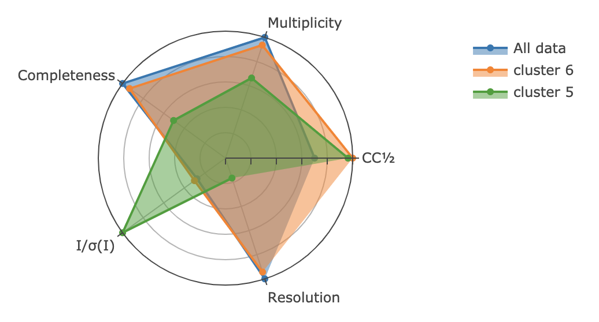

***************************
  What's New In DIALS 3.2
***************************

This article explains several notable new features in DIALS 3.2, released on
October 27th, 2020.

New Features
============

Speeding up Integration
-----------------------

Integration of rotation data should be ~35% faster with running with ``nproc > 1``. Before, sweeps
were split into blocks with a 50% overlap with neighbouring blocks in order to reduce the amount
of reflections that needed to be split, but this meant that the reflections
on each image were read out twice. This overlap has now been reduced which means less duplicated
effort in reading the data off of disk, and gives a notable speedup in runtime.
(`dials/dials#1396 <https://github.com/dials/dials/pull/1396>`_)

Comparing Merging Stats in XIA2 Multiplex
-----------------------------------------

When running ``xia2.multiplex``, the html report now includes a handy radar
plot (under "Cluster comparison") to make it easy to compare merging statistics
between clusters::

    $ xia2.multiplex $(dials.data get -q multi_crystal_proteinase_k)/*.{json,pickle} \
                     max_clusters=2

Each measure is scaled so that the "best" dataset for each attribute is equal
to one. (`xia2/xia#406 <https://github.com/xia2/xia2/pull/406>`_).

More Robust Image-sequence Validation
-------------------------------------

A couple of bugs were fixed relating to reading image filenames. Firstly, image
filenames of the form ``image00001`` had not been previously recognised as part
of a sequence, so were handled as individual images in ``dials.import``. This
caused problems with an experimental importer at Diamond, so has been fixed
(`dxtbx#234 <https://github.com/cctbx/dxtbx/pull/234>`_). A user also
`discovered <https://github.com/cctbx/dxtbx/issues/214>`_ that sometimes special
characters in an image file path caused errors, and this has been fixed. This
means that image paths like ``images/10%_subset/data/image_0001.cbf`` are now
usable.

Python Version Compatibility
----------------------------

The DIALS 3.2 binary release is now built with a base of python 3.8, a move
up from the DIALS 3.1 base of Python 3.6. This means that your scripts will
work with language changes from both `python 3.7 <https://docs.python.org/3/whatsnew/3.7.html>`_
and `python 3.8 <https://docs.python.org/3/whatsnew/3.8.html>`_, although core
DIALS code is maintaining support for python 3.6. You can also now
bootstrap a DIALS development environment with `python 3.9 <https://docs.python.org/3/whatsnew/3.8.html>`_,
although not everything is working yet.

Our current `intention <https://github.com/dials/dials/issues/1327>`_ is for
DIALS releases to support python 3.6 until conda-forge retires support, but
there is no current timescale for this.

API Features
============

"Scaled" flag in reflection tables
----------------------------------

After running :ref:`dials.scale`, it's now easy to select the subset of reflections
that had scaling weights applied::

    >> from dials.array_family import flex
    >> refls = flex.reflection_table.from_file("scaled.refl")
    >> len(refls)
    20717
    >> refls.get_flags(refls.flags.scaled).count(True)
    11778

"Available Cores" Convenience Function
--------------------------------------

A convenience function ``dials.util.mp.available_cores() -> int`` has been added. This
tries several ways to determine the appropriate number of processor "Cores" available to the
running program, including allocated cluster resources and platform-independent introspection.
At the moment, it knows how to tell if it's running inside an SGE/UGE environment by looking
for an ``NSLOTS`` environment variable, any system restrictions on what the process can access,
or otherwise the CPU count of the machine.